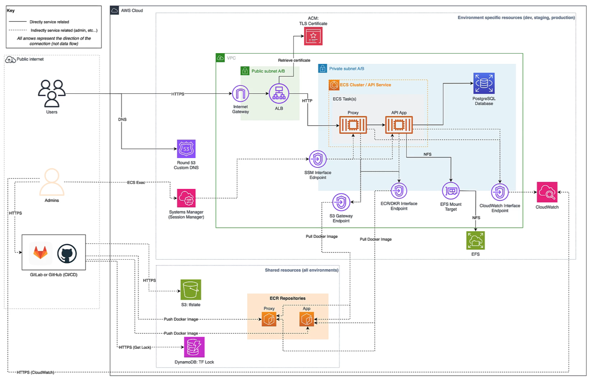
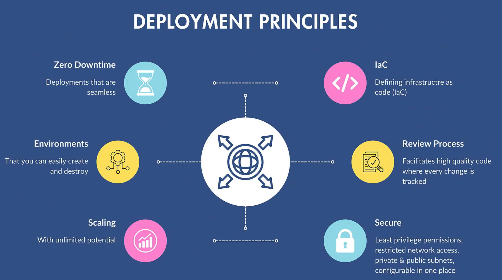
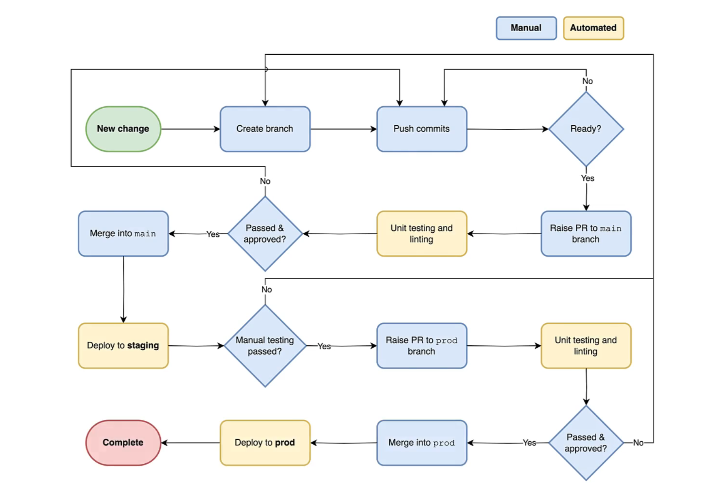

# 🚀 DevOps Deployment Automation with Terraform, AWS, and Docker  

[](https://github.com/your-username/your-repo/actions)  
[](https://hub.docker.com/r/your-dockerhub-username/your-image)  
  
  
  

This repository demonstrates **end-to-end DevOps automation** using **Terraform**, **AWS ECS**, **Docker**, and **CI/CD pipelines** with GitHub/GitLab. It covers local development, infrastructure as code (IaC), automated deployments, and production-ready principles.  

🔗 Starter code for the application: [DevOps Deployment Automation with Terraform, AWS and Docker](https://londonapp.dev/c3)  

---

## 📖 Table of Contents  

- [Local Development](#local-development)  
- [Architecture Overview](#architecture-overview)  
- [Deployment Principles](#deployment-principles)  
- [CI/CD Workflow](#cicd-workflow)  
- [AWS CLI & Terraform](#aws-cli--terraform)  
- [GitHub Actions & GitLab Variables](#github-actions--gitlab-variables)  
- [Software Requirements](#software-requirements)  
- [Other Resources](#other-resources)  

---

## 💻 Local Development  

This project runs using **Docker**, ensuring consistency across **Windows, macOS, and Linux**.  

### Run Project  

```sh
docker compose up
```

👉 Access the API: [http://127.0.0.1:8000/api/health-check/](http://127.0.0.1:8000/api/health-check/)  

### Create Superuser  

```sh
docker compose run --rm app sh -c "python manage.py createsuperuser"
```

👉 Admin Panel: [http://127.0.0.1:8000/admin](http://127.0.0.1:8000/admin)  

### Reset Environment  

```sh
docker compose down --volumes
docker compose up
```

---

## 🏗️ Architecture Overview  

The system is deployed using **AWS ECS (Fargate)**, **ECR**, **ALB**, **RDS (PostgreSQL)**, and **EFS**, all orchestrated via **Terraform**.  

### Architecture Diagram  

  

**Explanation:**  
- **Users** access the app via **Route53 DNS + ALB + ACM TLS**.  
- **ECS Tasks** run the **API App** and **Proxy** inside private subnets.  
- **RDS PostgreSQL** stores application data.  
- **EFS** provides shared file storage across ECS tasks.  
- **CloudWatch** handles logs/metrics.  
- **ECR** stores Docker images built via CI/CD pipelines.  
- **SSM Session Manager** enables secure admin access.  

This architecture ensures **high availability, security, and scalability** across **staging and production environments**.  

---

## ⚖️ Deployment Principles  

The following principles guide the automation and reliability of this project:  

  

- **Zero Downtime** → Seamless deployments  
- **IaC (Infrastructure as Code)** → Terraform-powered, reproducible environments  
- **Environments** → Easily create/destroy dev, staging, prod  
- **Review Process** → Every change is tracked & peer-reviewed  
- **Scaling** → ECS + ALB auto-scaling with AWS elasticity  
- **Secure** → Private/public subnets, least-privilege IAM policies, VPC isolation  

---

## 🔄 CI/CD Workflow  

The project follows a structured **GitOps-driven workflow** with **GitHub Actions/GitLab CI**.  

### Workflow Diagram  

  

**How it works:**  
1. **New change → Branch → Commit → Pull Request**  
2. **Automated unit tests & linting** run on every PR  
3. If approved → **Merge to `main` → Deploy to staging**  
4. **Manual testing** validates staging build  
5. If passed → **PR to `prod` → Auto-deploy to production**  
6. Ensures **safe, repeatable, and auditable deployments**  

This guarantees **quality, reliability, and no direct pushes to production**.  

---

## 🛠 AWS CLI & Terraform  

Authenticate using `aws-vault`:  

```sh
aws-vault exec PROFILE --duration=8h
```

Run Terraform commands:  

```sh
docker compose run --rm terraform -chdir=setup fmt
docker compose run --rm terraform -chdir=setup validate
docker compose run --rm terraform -chdir=setup plan
docker compose run --rm terraform -chdir=setup apply
```

Retrieve outputs:  

```sh
docker compose run --rm terraform -chdir=setup output
```

---

## 🔑 GitHub Actions & GitLab Variables  

Both **GitHub Actions** and **GitLab CI/CD** are supported.  

- Configure **AWS credentials, ECR repos, and Docker Hub credentials** as secrets.  
- Secrets include:  
  - `AWS_ACCESS_KEY_ID` / `AWS_SECRET_ACCESS_KEY`  
  - `DOCKERHUB_USER` / `DOCKERHUB_TOKEN`  
  - `TF_VAR_DB_PASSWORD`, `TF_VAR_DJANGO_SECRET_KEY`  

👉 See [original README details](#) for full variable list.  

---

## 📦 Software Requirements  

- [Docker Desktop](https://www.docker.com/products/docker-desktop)  
- [aws-vault](https://github.com/99designs/aws-vault)  
- AWS CLI v2  
- Git  

Verify installations:  

```sh
docker --version
aws --version
aws-vault --version
git --version
```

---

## 📚 Other Resources  

- [Terraform Docs](https://developer.hashicorp.com/terraform/docs)  
- [AWS ECS Exec](https://docs.aws.amazon.com/AmazonECS/latest/developerguide/ecs-exec.html)  
- [Docker Hub](https://hub.docker.com/)  

---

✅ With the **architecture diagram**, **deployment principles**, and **CI/CD workflow visualization**, this README provides a **complete DevOps picture** for contributors, reviewers, and learners.  
